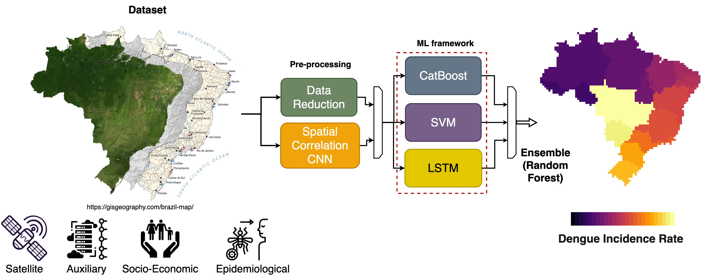

# A reproducible ensemble machine learning approach to forecast dengue outbreaks

Dengue fever, a prevalent and rapidly spreading arboviral disease, poses substantial public health and economic challenges in tropical and sub-tropical regions worldwide. Predicting infectious disease outbreaks on a countrywide scale is complex due to spatiotemporal variations in dengue incidence across administrative areas. To address this, we propose a machine learning (ML) ensemble model for forecasting the dengue incidence rate (DIR) in Brazil, with a focus on the population under 19 years old. The model integrates spatial and temporal information, providing one-month-ahead DIR estimates at the state level. Comparative analyses with a dummy model and ablation studies demonstrate the ensemble model's qualitative and quantitative efficacy across the 27 Brazilian Federal Units. Furthermore, we showcase the transferability of this approach to Peru, another Latin American country with differing epidemiological characteristics. This timely forecast system can aid local governments in implementing targeted control measures. The study advances climate services for health by identifying factors triggering dengue outbreaks in Brazil and Peru, emphasizing collaborative efforts with intergovernmental organizations and public health institutions. The innovation lies not only in the algorithms themselves but in their application to a domain marked by data scarcity and operational scalability challenges. We bridge the gap by integrating well-curated ground data with advanced analytical methods, addressing a significant deficiency in current practices. The successful transfer of the model to Peru and its consistent performance during the 2019 outbreak in Brazil showcase its scalability and practical application. While acknowledging limitations in handling extreme values, especially in regions with low DIR, our approach excels where accurate predictions are critical. The study not only contributes to advancing DIR forecasting but also represents a paradigm shift in integrating advanced analytics into public health operational frameworks. This work, driven by a collaborative spirit involving intergovernmental organizations and public health institutions, sets a precedent for interdisciplinary collaboration in addressing global health challenges. It not only enhances our understanding of factors triggering dengue outbreaks but also serves as a template for the effective implementation of advanced analytical methods in public health.

## Guide

1. [Installation guide](guide/installation.md)
2. [Configuration](guide/config.md)
3. [Dataset](guide/data.md)
3. [Run our code](guide/code.md)

## Cite our papers

1. Schneider, R., Sebastianelli, A., Spiller, D., Wheeler, J., Carmo, R., Nowakowski, A., ... & Lowe, R. (2021). Climate-based ensemble machine learning model to forecast Dengue epidemics (papers track). In Thirty-eighth International Conference on Machine Learning (ICML) 2021.

        @inproceedings{schneider2021climate,
            title={Climate-based ensemble machine learning model to forecast Dengue epidemics (papers track)},
            author={Schneider, Rochelle and Sebastianelli, Alessandro and Spiller, Dario and Wheeler, James and Carmo, Raquel and Nowakowski, Artur and Garcia-Herranz, Manuel and Kim, Dohyung and Barlevi, Hanoch and Cordero, Zoraya El Raiss and others},
            booktitle={Thirty-eighth International Conference on Machine Learning (ICML) 2021},
            year={2021}
        }

2. Sebastianelli, A., Spiller, D.,  Carmo, R.,  Wheeler, J., Nowakowski, A., ... & Schneider, R. (2024). A reproducible ensemble machine learning approach to forecast dengue outbreaks. In Nature Scientific Reports.
        
        @inproceedings{sebsatianelli2024reproducible,
            title={A reproducible ensemble machine learning approach to forecast dengue outbreaks},
            author={Alessandro Sebastianelli, Dario Spiller, Raquel Carmo, James Wheeler, Artur Nowakowski, Ludmilla Viana Jacobson, Dohyung Kim, Hanoch Barlevi, Zoraya El Raiss Cordero, Felipe J Colon-Gonzalez, Rachel Lowe, Silvia Liberata Ullo, and Rochelle Schneider}, 
            journal={Nature Scientific Reports},
            year={2024},
        }